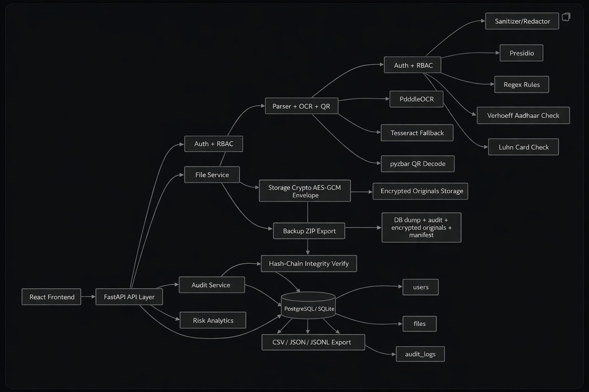
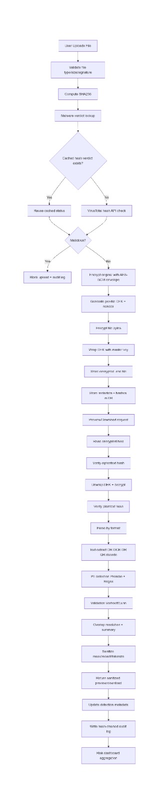

<h1 align="center">🛡️ PII Guardian</h1>

<p align="center">
  <b>AI-Powered PII Detection, Sanitization & Cyber Defense Platform</b>
</p>

<p align="center">
  
  
  
  
  
  
  
</p>

---

> **PII Guardian** is a cybersecurity platform that detects, classifies, and sanitizes Personally Identifiable Information (PII) across 10+ file formats — while defending against malware, enforcing encryption at rest, and maintaining tamper-proof audit trails. Built for DPDP Act 2023, GDPR & HIPAA compliance.

---

## 🔍 Problem Statement

Organizations handle SQL dumps, PDFs, scanned documents, and spreadsheets daily — all containing sensitive PII (Aadhaar, PAN, bank accounts, emails, etc.). The risks:

- 🚨 **Regulatory penalties** — DPDP Act violations up to ₹250 crore
- 🦠 **Malware-laced uploads** — Trojans and ransomware hidden in document uploads
- 🔓 **Plaintext file storage** — One misconfiguration away from full data exposure
- 👁️ **Blind spots in images** — PII in scanned PDFs and QR codes evades text-based tools

PII Guardian automates PII discovery, malware blocking, encryption, and audit — eliminating manual review entirely.

---

## 💡 Solution Overview

1. 🦠 **Scan for malware** via VirusTotal (SHA-256 hash lookup against 70+ AV engines)
2. 🚫 **Block executables** — PE, ELF, Mach-O binaries rejected at byte level
3. 🧠 **Detect PII** through a 4-layer pipeline: Regex → Presidio NER → Luhn/Verhoeff validation → optional LLM
4. ✂️ **Sanitize** with three modes: mask, redact, or tokenize — preserving document format
5. 🔐 **Encrypt** with AES-256-GCM envelope encryption (per-file DEK + master key wrapping)
6. 🔗 **Audit** every action in SHA-256 hash-chained logs (tamper-proof)

---

## ⭐ Key Features

### 🧠 4-Layer PII Detection Pipeline

```
Layer 1: Regex Engine           → 30+ patterns (Aadhaar, PAN, credit cards, etc.)
Layer 2: Microsoft Presidio     → spaCy NER for names, addresses
Layer 3: Mathematical Validation → Luhn (credit cards), Verhoeff (Aadhaar)
Layer 4: LLM (Optional)        → OpenAI GPT-4o / Ollama / HuggingFace
```

**20+ Entity Types:** Name, Email, Phone, Aadhaar, PAN, VID, Passport, Credit Card, Bank Account, IFSC, UPI, IP Address, DOB, Address, Device ID, Fingerprint Template, Face Template

### 📄 10+ File Formats

| Format | Method |
|--------|--------|
| PDF | pdfplumber + PyMuPDF, OCR fallback for scanned pages |
| DOCX | python-docx (paragraphs + tables) |
| Excel | openpyxl / xlrd, cell-by-cell scanning |
| Images | PaddleOCR + Tesseract (English, Hindi, Gujarati) |
| QR/Barcode | pyzbar — decodes embedded UPI links, vCards |
| SQL, CSV, JSON, TXT | Direct parsing with format-aware extraction |

### ✂️ Sanitization Modes

| Mode | Example |
|------|---------|
| **Mask** | `XXXX XXXX 1234` (Aadhaar), `J*** D***` (Name), `r***@gmail.com` |
| **Redact** | `[REDACTED_IN_AADHAAR]`, `[REDACTED_EMAIL_ADDRESS]` |
| **Tokenize** | `TOKEN_EMAIL_ADDRESS_0001` → reversible mapping stored securely |

Output preserves original format: DOCX → DOCX, PDF → PDF, Excel → Excel, JSON → JSON.

### 📊 Risk Dashboard

- **Risk Score**: 0–100 per file (weighted: Aadhaar/Card = 10, Passport/PAN = 8, Email/Phone = 5)
- **Risk Levels**: Critical (80+), High (60-79), Medium (30-59), Low (<30)
- **Per-User Scores** and **Top Risk Files** for admin oversight

---

## 🔒 Cybersecurity & Threat Defense

### 🦠 VirusTotal Malware Scanning

Every uploaded file is SHA-256 hashed and checked against VirusTotal's 70+ antivirus engines. Files flagged `malicious` are **auto-rejected** with a `MALWARE_BLOCK` audit entry. Results are cached to avoid redundant lookups.

### 🚫 Executable Blocking

Binary signatures detected and blocked at upload:

| Signature | Format |
|-----------|--------|
| `MZ` | Windows PE (.exe/.dll) |
| `\x7fELF` | Linux ELF |
| `\xcf\xfa\xed\xfe` / `\xfe\xed\xfa\xcf` | macOS Mach-O |

### 🔐 AES-256-GCM Envelope Encryption

- Per-file random 256-bit **Data Encryption Key (DEK)**
- DEK wrapped by **Master Key** using AES-256-GCM
- **Dual integrity**: SHA-256 of plaintext + ciphertext verified on every read
- Legacy Fernet records seamlessly supported

### 🔑 Authentication & Access Control

| Feature | Detail |
|---------|--------|
| JWT Auth | Configurable expiry (default 8h) |
| bcrypt Hashing | Rainbow table + GPU resistant |
| Brute-Force Lockout | 5 failed attempts → 15-min lock |
| RBAC | Admin: full access. User: sanitized-only |
| Step-Up Auth | Re-enter password for raw downloads/backups |

### 🛡️ Security Hardening

- **Security Headers**: `X-Content-Type-Options: nosniff`, `X-Frame-Options: DENY`, `Referrer-Policy: no-referrer`, `Cache-Control: no-store`
- **Rate Limiting**: 120 req/60s per IP (sliding window)
- **CORS**: Configurable allowed origins
- **HTTPS**: Optional SSL/TLS support
- **Startup Validation**: Refuses to start with weak secrets in production

### 🔗 Hash-Chained Audit Logs

Every action is logged with a SHA-256 hash that chains to the previous entry — blockchain-style tamper detection:

```python
hash = SHA-256(f"{user_id}|{action}|{details}|{timestamp}|{prev_hash}")
```

**Audited events:** `FILE_UPLOAD`, `MALWARE_BLOCK`, `USER_ACCESS`, `FILE_DOWNLOAD`, `STEPUP_FAIL`, `BACKUP_EXPORT`, `LOGIN_SUCCESS/FAIL`, `USER_CREATE/DELETE`

### 📅 Data Retention

- Configurable retention period (default 30 days)
- Legal hold flag to bypass auto-deletion
- Encrypted backup export (ZIP with manifest + integrity checksums)

---

## 🏗️ Architecture




## 🛠️ Tech Stack

| Layer | Technology |
|-------|-----------|
| **Frontend** | React 19, Vite 7, Vanilla CSS |
| **Backend** | Python 3.11+, FastAPI, Uvicorn, SQLAlchemy |
| **AI / NLP** | Microsoft Presidio, spaCy, Regex, Luhn/Verhoeff |
| **LLM** | OpenAI GPT-4o-mini, Ollama, HuggingFace Transformers |
| **OCR** | PaddleOCR, Tesseract, OpenCV |
| **File Parsing** | pdfplumber, PyMuPDF, python-docx, openpyxl, xlrd |
| **Crypto** | AES-256-GCM, Fernet, SHA-256, bcrypt |
| **Malware** | VirusTotal API v3 |
| **Database** | SQLite (PostgreSQL-ready) |

---

## Data flow




| Step | Action | Security |
|------|--------|----------|
| 1 | JWT login (bcrypt verified) | Brute-force lockout (5 attempts → 15min) |
| 2 | File upload (≤25 MB) | Binary signatures blocked |
| 3 | SHA-256 → VirusTotal lookup | Malicious files auto-rejected |
| 4 | Text extraction (PDF/DOCX/OCR/QR) | 10+ format support |
| 5 | 4-layer PII detection | Overlap resolution + dedup |
| 6 | Sanitize (mask/redact/tokenize) | Format-preserving output |
| 7 | AES-256-GCM encryption | Per-file DEK + dual SHA-256 |
| 8 | RBAC access control | Step-up auth for raw downloads |
| 9 | Hash-chained audit log | Tamper-proof event trail |

---

## 🚀 Installation & Setup

### Prerequisites

Python 3.11+ · Node.js 18+ · npm 9+ · Tesseract OCR 3.05+ (optional)

### Backend

```powershell
cd backend
python -m venv venv
venv\Scripts\activate
pip install -r requirements.txt
python -m spacy download en_core_web_lg
copy .env.example .env    # Edit with your keys
python main.py
```

**Required `.env` settings:**
```env
JWT_SECRET_KEY=your-strong-secret
FILE_MASTER_KEY=your-32-byte-key
ADMIN_REGISTRATION_TOKEN=your-admin-token
VIRUSTOTAL_ENABLED=true
VIRUSTOTAL_API_KEY=your-vt-api-key
```

> API: `http://127.0.0.1:8000` · Docs: `http://127.0.0.1:8000/docs`

### Frontend

```powershell
cd frontend/frontend
npm install
npm run dev
```

> App: `http://localhost:5173`

### Optional

```env
# HTTPS
SSL_CERTFILE=path/to/cert.pem
SSL_KEYFILE=path/to/key.pem

# LLM Detection
USE_LLM=true
OPENAI_API_KEY=sk-your-key
```

---

## 📖 Usage

**Admin:** Register → Upload files → View detections & risk scores → Preview raw/sanitized → Download → Manage users → Review audit logs → Export backups

**User:** Login → Browse Sanitized Hub → Search/filter → Download sanitized files only

**Demo files** in `demo_samples/`: `sample_pii.sql`, `sample_pii.pdf`, `sample_pii.docx`

---

## 📸 Screenshots


---

## 📁 Folder Structure

```
pii-guardian/
├── backend/
│   ├── main.py                 # FastAPI app + security middleware
│   ├── requirements.txt
│   ├── .env.example
│   ├── secure_storage/         # AES-encrypted files
│   └── app/
│       ├── models/             # User, FileRecord, AuditLog
│       ├── routes/             # auth, files, audit
│       ├── services/           # pii_detector, file_parser, sanitizer
│       └── utils/              # storage_crypto, security
├── frontend/
│   └── frontend/src/
│       ├── App.jsx             # Main app
│       └── components/         # 9 React components
├── demo_samples/               # Sample PII files
├── docs/                       # Architecture diagrams
└── README.md
```

---


## 🧗 Challenges Faced

| Challenge | Solution |
|-----------|----------|
| Malware in uploads | VirusTotal API v3 SHA-256 hash scanning with auto-blocking |
| Secure storage | AES-256-GCM envelope encryption + dual SHA-256 integrity checks |
| Scanned PDFs | Dual OCR pipeline (PaddleOCR + Tesseract fallback) |
| False positive PII | Verhoeff (Aadhaar) + Luhn (cards) + overlap resolution |
| Format preservation | Format-specific sanitization engines (DOCX, PDF, Excel, JSON) |
| Brute-force attacks | Account lockout + timed lock + audit logging |
| Tamper-proof audit | SHA-256 hash-chained log entries (blockchain-style) |
| QR code PII | pyzbar decoding → full PII pipeline on decoded payloads |
| Executable injection | Byte-level PE/ELF/Mach-O signature blocking |

---

## 👥 Team Members

Sahil Chandel   

Devansh  Deshpande 

Ayush Bhatnagar

Priyansh Patel

Dharm Patel


---


