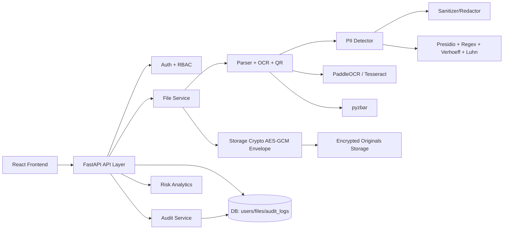
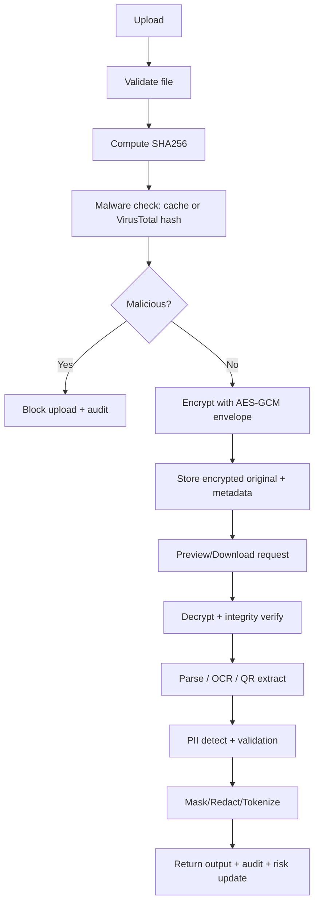

# PII Guardian

PII Guardian is a secure privacy platform that detects and sanitizes sensitive data across files (text, documents, images, scanned PDFs), with role-based access control, encrypted-at-rest storage, risk analytics, tamper-evident audit logs, SIEM export, and disaster-recovery backup export.

## What This Project Solves

Organizations handle mixed files that often contain PII. Manual redaction is slow, inconsistent, and hard to audit.  
PII Guardian automates:
- PII detection
- masking/redaction/tokenization
- secure sharing
- compliance-ready auditing
- risk visibility

## Key Features

- Multi-format support: SQL, CSV, JSON, TXT, PDF, DOCX, PNG/JPG/JPEG, XLS/XLSX family
- OCR for scanned files/images: PaddleOCR with Tesseract fallback
- QR/barcode extraction via pyzbar
- Detection engine:
  - Presidio + regex
  - Verhoeff validation (Aadhaar)
  - Luhn validation (card-like numbers)
  - Overlap resolution and entity prioritization
- Sanitization modes: `mask`, `redact`, `tokenize`
- Original-format sanitized downloads
- RBAC:
  - Admin: full access + user management + audit + backup
  - User: restricted access (no admin operations)
- Security:
  - AES-GCM envelope encryption at rest
  - ciphertext/plaintext integrity checks (SHA-256)
  - step-up password for sensitive downloads
  - upload binary signature blocking
  - rate limiting + security headers + CORS allowlist
- Audit:
  - hash-chained tamper-evident logs
  - integrity verification endpoint
  - CSV/JSON/JSONL export (SIEM-friendly)
- Risk Dashboard:
  - overall risk score
  - top exposed PII types
  - per-file risk
  - per-user risk (admin)
- Backup export:
  - admin ZIP backup containing DB dump, encrypted originals, audit JSONL, config snapshot, manifest
- Optional VirusTotal hash check with per-hash cache reuse to reduce token usage

## Architecture



## Processing Flow



## PII Entity Coverage

- `EMAIL_ADDRESS`
- `PHONE_NUMBER`
- `IP_ADDRESS`
- `IN_PAN`
- `IN_AADHAAR`
- `IN_VID`
- `DATE_OF_BIRTH`
- `PERSON_NAME`
- `IN_ADDRESS`
- `UPI_ID`
- `CREDIT_CARD`
- `PASSPORT_NUMBER`
- `BANK_ACCOUNT`
- `IFSC_CODE`
- `BANK_NAME`
- `DEVICE_ID`
- `FINGERPRINT_TEMPLATE`
- `FACE_TEMPLATE`

## Repository Structure

```text
pii-guardian/
  backend/
    app/
      routes/         # auth, file, audit APIs
      services/       # parser, detector, sanitizer, audit logic
      models/         # users/files/audit_logs tables
      utils/          # security + storage encryption
      database/       # db session + startup migrations
  frontend/frontend/
    src/components/   # UI panels (upload, files, audit, risk, users)
    src/lib/api.js    # API wrapper
```

## Quick Start

### 1) Backend

```powershell
cd backend
python -m venv venv
venv\Scripts\activate
pip install -r requirements.txt
copy .env.example .env
python main.py
```

Backend default: `http://127.0.0.1:8000`

### 2) Frontend

```powershell
cd frontend\frontend
npm install
npm run dev
```

Frontend default: `http://localhost:5173`

Optional:
```env
VITE_API_BASE_URL=http://127.0.0.1:8000
```

## Required/Important Environment Variables

In `backend/.env`:

- Core:
  - `DATABASE_URL`
  - `JWT_SECRET_KEY`
  - `FILE_MASTER_KEY` (recommended) or `FILE_ENCRYPTION_KEY` (legacy fallback)
- Security:
  - `MAX_UPLOAD_MB`
  - `RATE_LIMIT_WINDOW_SECONDS`
  - `RATE_LIMIT_REQUESTS`
  - `STEPUP_REQUIRED_FOR_RAW_DOWNLOAD`
  - `BACKUP_STEPUP_REQUIRED`
- OCR:
  - `OCR_LANGS=en,hi,gu`
  - `OCR_TESS_LANGS=eng+hin+guj`
  - `OCR_USE_ANGLE_CLS=true`
  - `PADDLE_PDX_CACHE_HOME=.paddlex`
  - `USE_QR_SCAN=true`
- Detection:
  - `USE_PRESIDIO=true`
  - `REQUIRE_AADHAAR_VERHOEFF=true|false`
- Optional VirusTotal:
  - `VIRUSTOTAL_ENABLED=true|false`
  - `VIRUSTOTAL_API_KEY=...`
  - `VIRUSTOTAL_TIMEOUT_SECONDS=12`

## API Overview

### Auth
- `POST /auth/signup`
- `POST /auth/login`
- `GET /auth/me`
- `GET /auth/users` (admin)
- `PUT /auth/users/{user_id}/role` (admin)

### Files
- `POST /files/upload`
- `GET /files`
- `GET /files/sanitized-catalog`
- `GET /files/search`
- `GET /files/risk-dashboard`
- `GET /files/{id}/raw-preview`
- `GET /files/{id}/sanitized-preview`
- `GET /files/{id}/download`
- `GET /files/{id}/download-sanitized-original`
- `GET /files/{id}/download-original` (step-up)
- `GET /files/admin/backup-download` (admin, step-up)
- `POST /files/admin/cleanup-expired` (admin)
- `POST /files/{id}/legal-hold` (admin)
- `DELETE /files/{id}` (admin)

### Audit
- `GET /audit/logs` (admin)
- `GET /audit/verify-integrity` (admin)
- `GET /audit/logs/download?format=csv|json|jsonl` (admin)

## Security Design Notes

- Original files are not stored as plaintext.
- AES-GCM envelope encryption:
  - random per-file DEK encrypts data
  - DEK wrapped with master key
- On read:
  - verify ciphertext hash
  - decrypt
  - verify plaintext hash
- Audit records are hash-chained with `prev_hash` and `log_hash`.

## Demo Script (Judge-Friendly)

1. Login as admin
2. Upload sample SQL/PDF/Doc/Image
3. Show sanitized preview + entity summary
4. Download sanitized original-format file
5. Show raw download requires step-up password
6. Open Risk Dashboard and explain per-file/per-user risk
7. Open Audit tab, verify integrity, export logs (JSONL)
8. Download Backup ZIP and show manifest contents

## Production Hardening Recommendations

- Keep `FILE_MASTER_KEY` in a proper secret manager
- Use HTTPS termination (reverse proxy or cert/key)
- Restrict CORS origins strictly
- Enable centralized log shipping/SIEM ingestion
- Add local malware scanner (ClamAV) in addition to VT hash reputation
- Add S3/KMS storage backend for scalable production

## License

Add your preferred license (MIT/Apache-2.0/etc.) here.
